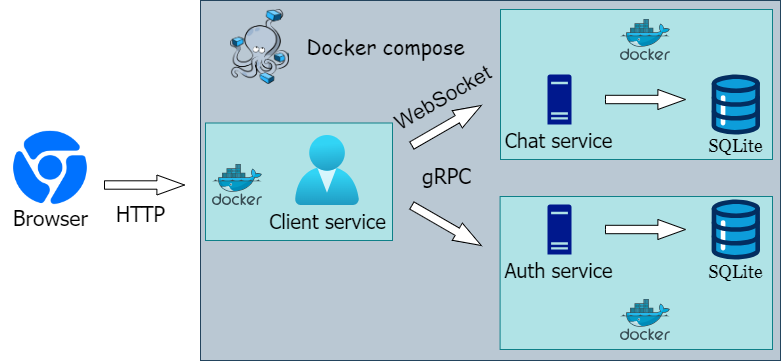
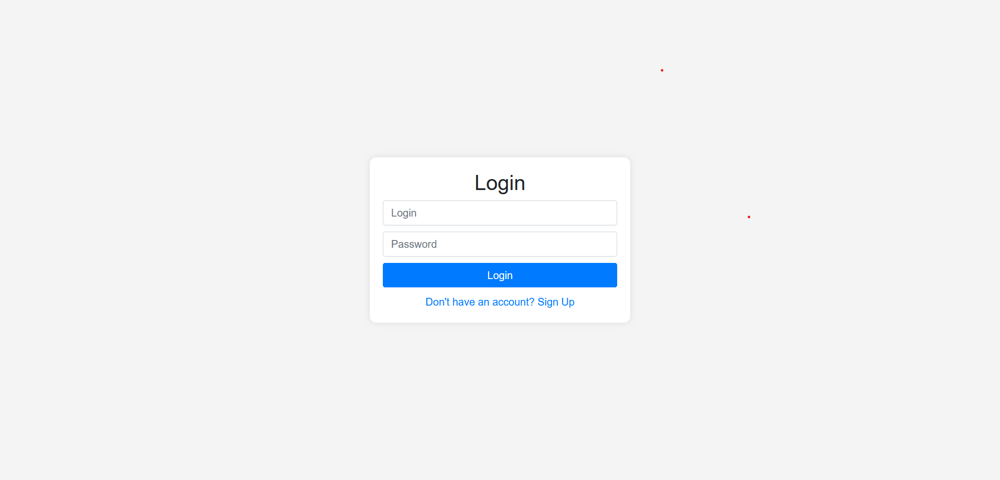
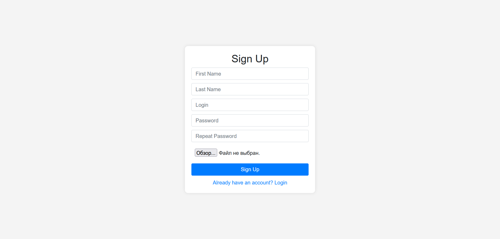
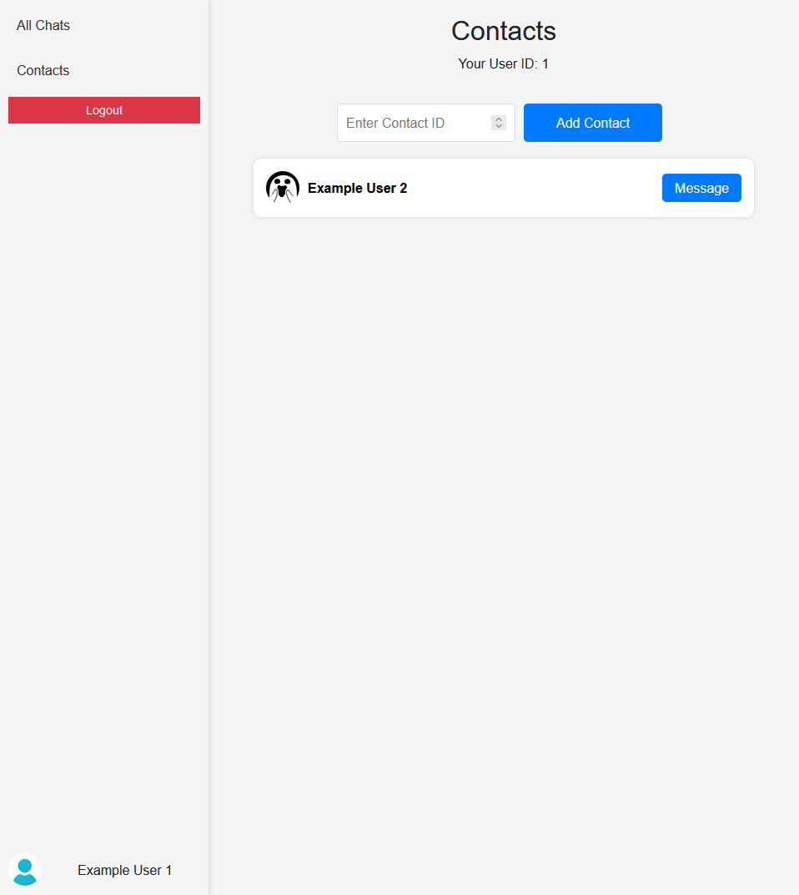
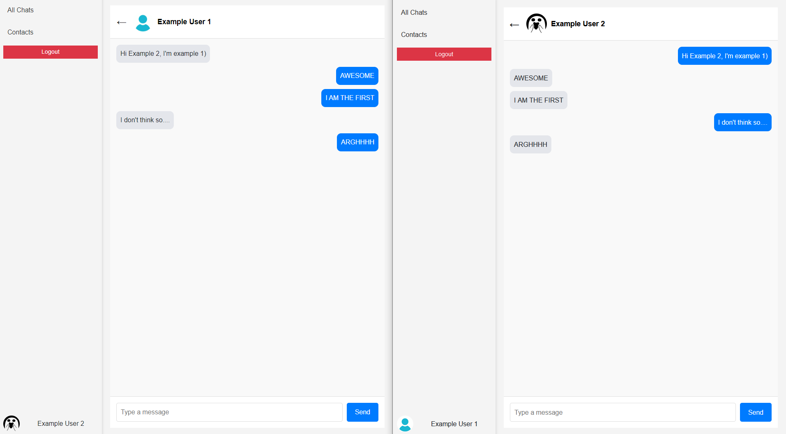

# Chat
##### `Chat` is a project, that made to show code style, stack of technologies and skills

#### `Chat` is a simple chatting web site with opportunity to reg, adding contacts and talking with users in personal messages
# Structure


# Stack
- ### Language
  - Golang (v1.22.3)
- ### Database
  - SQLite3
- ### Other techniques
  - Docker-compose
  - gRPC
  - WebSocket
  - JWT
# Installation

### Requirements
- Docker-compose
- Git
```shell
git clone https://github.com/Smile8MrBread/Chat.git
cd Chat
docker-compose up --build
```
#### Then, after starting all images, go to browser on http://localhost:8080 and testing 😊
# Preview



